KOCAELİ ÜNİVERSİTESİ
Bilişim Sistemleri Mühendisliği
TBL331 - Veritabanı Yönetim Sistemleri

WEB VE iOS DESTEKLİ E-TİCARET SİSTEMİ
Proje Konusu: Online Alışveriş Sitesi
Grup No: 33

Grup Üyeleri ve Görevleri
Sueda Tut: Veritabanı tabloları, SQL kodları, tablo ilişkileri, ER diyagramı ve dummy data
Zeynep Güngör: Web frontend tasarımı, arayüz düzenlemeleri 
Zeynep Bulut: Backend geliştirme, API bağlantıları, Supabase entegrasyonu ve test süreçleri
Tüm Ekip=GitHub düzeni, sunum hazırlığı, README raporu ve genel proje kontrolü

1. Proje Özeti
Bu proje, kullanıcıların ürünleri görüntüleyebildiği, kategoriye göre filtreleme ve ürün arama yapabildiği, ürünleri sepete ekleyebildiği, sipariş oluşturabildiği ve sipariş geçmişini takip edebildiği web ve iOS destekli bir e-ticaret sistemidir. Sistem aynı zamanda admin rolüne sahip kullanıcıların ürün ekleme, ürün güncelleme, ürün silme ve stok kontrolü gibi yönetim işlemlerini gerçekleştirebilmesini hedeflemektedir. 

Proje kapsamında kullanıcı arayüzü, backend servisleri ve ilişkisel veritabanı birlikte ele alınmıştır. Web ve mobil arayüz Flutter tabanlı geliştirilmiş; backend tarafında Node.js ve Express.js ile API yapısı kurulmuş; veritabanı tarafında PostgreSQL/Supabase kullanılarak kullanıcı, ürün, kategori, sepet, sipariş ve adres süreçleri modellenmiştir. 

2. Problem Tanımı
E-ticaret sistemlerinde ürünlerin doğru kategoriler altında listelenmesi, kullanıcıların sepet ve sipariş süreçlerinin tutarlı şekilde yönetilmesi, stok bilgilerinin güncel kalması ve kullanıcı bilgilerinin güvenli bir şekilde saklanması önemlidir. Bu süreçler yalnızca görsel arayüzle çözülemez; arka planda doğru tasarlanmış bir veritabanı ve düzenli çalışan bir backend yapısı gerekir. 

Bu proje kapsamında çözülmesi hedeflenen problem, kullanıcıların web veya iOS arayüzü üzerinden ürünleri kolayca inceleyebileceği, sepete ürün ekleyip çıkarabileceği, sipariş verebileceği ve sipariş geçmişini görüntüleyebileceği bir e-ticaret altyapısı oluşturmaktır. Admin tarafında ise ürün yönetimi ve stok kontrolü gibi işlemler desteklenerek sistemin yönetilebilir olması amaçlanmıştır.

3. Projenin Amacı
*Web ve iOS platformlarında çalışabilecek temel bir e-ticaret sistemi geliştirmek. 
*Kullanıcıların kayıt olma, giriş yapma, ürün görüntüleme, filtreleme, sepete ekleme ve sipariş verme işlemlerini gerçekleştirebilmesini sağlamak. 
*Admin kullanıcıların ürün ekleme, ürün güncelleme, ürün silme ve stok kontrolü yapabilmesini sağlamak. 
*Veritabanı tarafında 5N normalizasyon kurallarına uygun, ilişkisel ve tutarlı bir yapı kurmak. 
*Index, View, Trigger, Function ve Stored Procedure yapılarını amaca uygun şekilde kullanmak. 
*Gerçekçi dummy data ile sistemin test edilebilirliğini göstermek.

4. Kullanılan Teknolojiler
Frontend / Mobil: Flutter, Dart, Responsive arayüz tasarımı, Web ve iOS arayüzleri
Backend: Node.js, Express.js, REST API yapısı
Veritabanı: PostgreSQL, Supabase
Versiyon Kontrol: Git, Github
Geliştirme Araçları: Visual Studio Code, npm, Flutter SDK, Tarayıcı, Supabase Dashboard

5. Geliştirme Ortamı
Proje geliştirme sürecinde Visual Studio Code, GitHub, Supabase Dashboard, PostgreSQL, Node.js, npm, Flutter SDK ve web tarayıcısı kullanılmıştır. Backend ve frontend/mobil yapıları ayrı terminal süreçleriyle çalıştırılmıştır. Veritabanı işlemleri Supabase paneli ve SQL betikleri üzerinden yürütülmüştür.

6. Genel Sistem Yapısı 
Sistem üç temel katmandan oluşmaktadır: kullanıcı arayüzü, backend/API katmanı ve veritabanı katmanı. 

6.1 Kullanıcı Arayüzü 
Kullanıcılar web veya iOS arayüzü üzerinden sisteme erişir. Ürün listeleme, ürün arama, kategori filtreleme, ürün detaylarını görüntüleme, sepete ekleme/çıkarma ve sipariş oluşturma işlemleri bu katmanda gerçekleştirilir. 

6.2 Backend Katmanı 
Backend katmanı istemciden gelen istekleri alır, gerekli kontrolleri yapar ve veritabanı ile iletişimi sağlar. Ürün, kategori, sepet, sipariş ve kullanıcı işlemleri REST API uç noktaları üzerinden yürütülür. 

6.3 Veritabanı Katmanı 
Veritabanı katmanı kullanıcılar, ürünler, kategoriler, sepetler, siparişler, sipariş detayları ve adres bilgileri gibi kalıcı verileri saklar. Tablolar arası ilişkiler Foreign Key yapılarıyla kurulmuştur.

7. Veritabanı Tasarımı
Proje kapsamında toplam 9 tablo kullanılarak ilişkisel bir veritabanı tasarımı yapılmıştır. Tablolar, veri tekrarını azaltacak ve ilişkileri açık gösterecek şekilde ayrılmıştır.
users: Sisteme kayıtlı kullanıcı bilgilerini tutar.
categories: Ürün kategorilerini tutar.
products:Ürün bilgilerini ve stok durumunu tutar.
cart: Kullanıcının aktif sepet bilgisini tutar.
cart_items: Sepette bulunan ürünlerin detaylarını tutar.
orders: Kullanıcıların oluşturduğu siparişleri tutar.
order_items: Sipariş içindeki ürün detaylarını tutar.
addresses: Kullanıcılara ait adres bilgilerini tutar.
shops: Mağazalara ait temel bilgileri tutar.

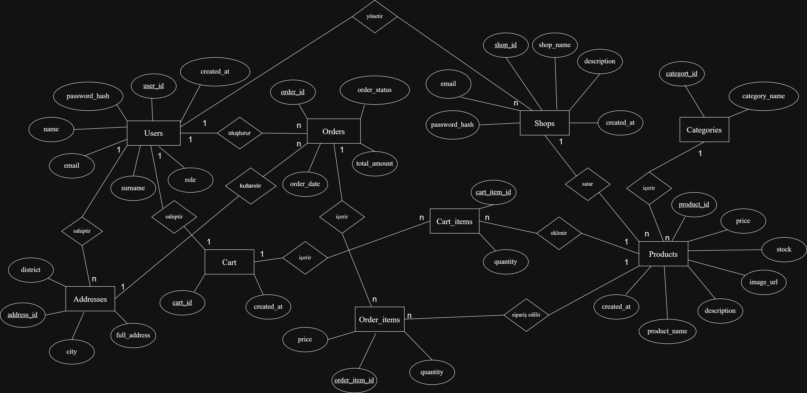

8. Tablolar ve İlişkiler
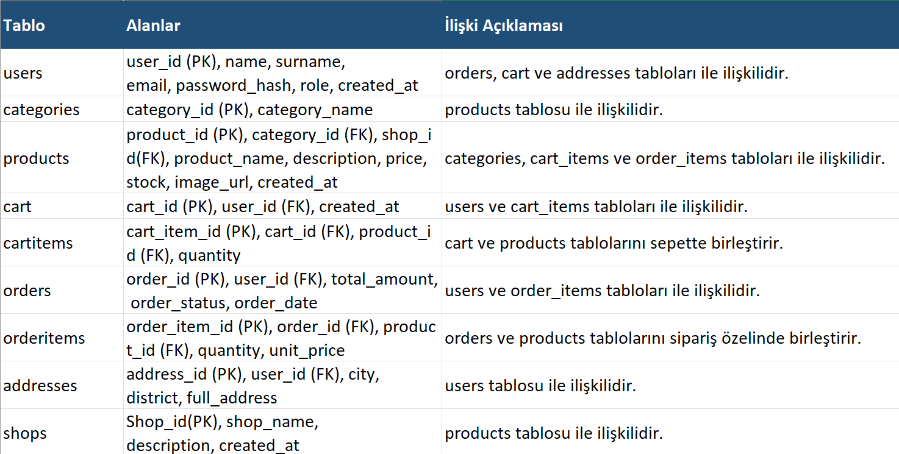

9. Normalizasyon Açıklaması
Veritabanı tasarımında veri tekrarını azaltmak, veri bütünlüğünü korumak ve ekleme, silme, güncelleme anomalilerini önlemek amacıyla normalizasyon kurallarına dikkat edilmiştir. Ürün kategorileri products tablosunda metin olarak tekrar tekrar tutulmak yerine categories tablosunda saklanmıştır. Products tablosu yalnızca category_id alanı ile kategoriye bağlanmıştır. 

Benzer şekilde sipariş bilgileri orders tablosunda, siparişin ürün bazlı detayları ise order_items tablosunda tutulmuştur. Bu sayede bir siparişin birden fazla ürün içerebilmesi sağlanmıştır. Sepet yapısında da cart ve cart_items tabloları ayrılarak kullanıcının aktif sepeti ile sepetteki ürünler ayrı modellenmiştir. Kullanıcı adresleri addresses tablosunda tutulduğu için bir kullanıcının birden fazla adres bilgisi sisteme eklenebilir.

10. Kullanılan Kısıtlayıcılar
Veri bütünlüğünü sağlamak için aşağıdaki kısıtlayıcılar kullanılmıştır:
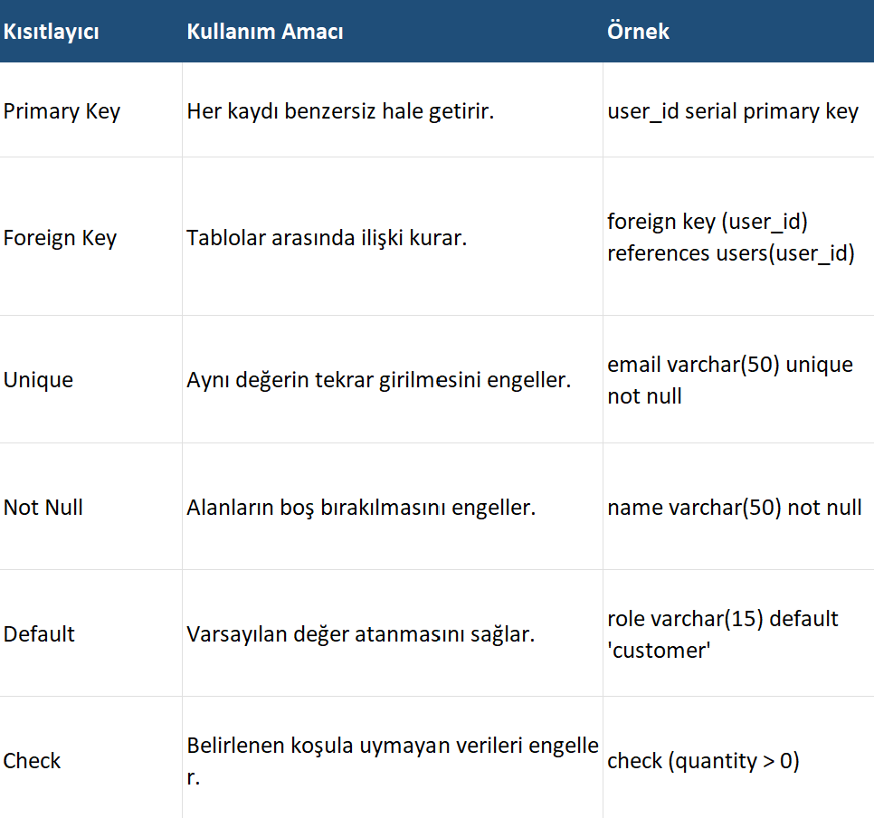

11. Index Kullanımı
Index yapıları, sık kullanılan sorguların daha hızlı çalışması için kullanılmıştır. Özellikle kullanıcı e-posta aramaları, ürün adı aramaları ve kategoriye göre ürün listeleme işlemleri için index kullanımı performans açısından önemlidir. 

CREATE INDEX email_index ON users(email); 
CREATE INDEX product_name_index ON products(product_name); 
CREATE INDEX category_index ON products(category_id); 
CREATE INDEX orders_user_index ON orders(user_id); 

12. View Kullanımı
View yapıları, birden fazla tabloyu birleştiren sorguların daha okunabilir ve tekrar kullanılabilir hale gelmesi için kullanılmıştır. 

CREATE VIEW product_details_view AS 
SELECT products.product_name, categories.category_name, 
       products.price, products.stock 
FROM products 
INNER JOIN categories ON products.category_id = categories.category_id; 
 
CREATE VIEW user_orders_view AS 
SELECT users.name, users.surname, orders.order_date, 
       orders.total_amount, orders.order_status 
FROM orders 
INNER JOIN users ON orders.user_id = users.user_id; 

13. Trigger Kullanımı
Trigger yapısı, sipariş detayına ürün eklendiğinde ürün stok miktarının otomatik azaltılması için kullanılmıştır. Bu yaklaşım, stok güncelleme işleminin manuel unutulmasını engeller ve veritabanı tarafında otomatik kontrol sağlar. 

CREATE OR REPLACE FUNCTION decrease_stock_function() 
RETURNS TRIGGER AS $$ 
BEGIN 
    UPDATE products 
    SET stock = stock - NEW.quantity 
    WHERE product_id = NEW.product_id; 
 
    RETURN NEW; 
END; 
$$ LANGUAGE plpgsql; 
 
CREATE TRIGGER decrease_stock_trigger 
AFTER INSERT ON order_items 
FOR EACH ROW 
EXECUTE FUNCTION decrease_stock_function(); 

14. Stored Procedure Kullanımı
Stored Procedure yapısı, yeni sipariş oluşturma gibi tekrar eden işlemlerin veritabanı tarafında düzenli ve kontrollü şekilde yapılmasını sağlar. 

CREATE OR REPLACE PROCEDURE create_order_procedure( 
    p_user_id INTEGER, 
    p_total_amount NUMERIC, 
    p_order_status VARCHAR 
) 
LANGUAGE plpgsql AS $$ 
BEGIN 
    INSERT INTO orders(user_id, total_amount, order_status) 
    VALUES (p_user_id, p_total_amount, p_order_status); 
END; 
$$; 

15. Akış Şeması
Aşağıdaki akış şeması, müşterinin sisteme girişinden sipariş durumunun görüntülenmesine kadar olan temel işlemleri göstermektedir.

16. Yazılım Mimarisi
Proje katmanlı mimari mantığıyla geliştirilmiştir. Kullanıcı arayüzü, API katmanı, backend iş mantığı ve veritabanı katmanı birbirinden ayrılarak sistemin daha düzenli ve yönetilebilir olması sağlanmıştır.
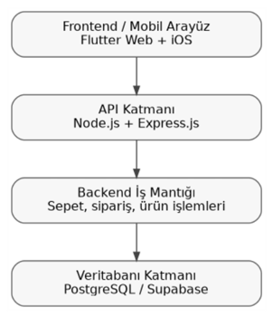

17. API Yapısı
Backend tarafında temel işlemler için aşağıdaki REST API uç noktaları planlanmıştır:
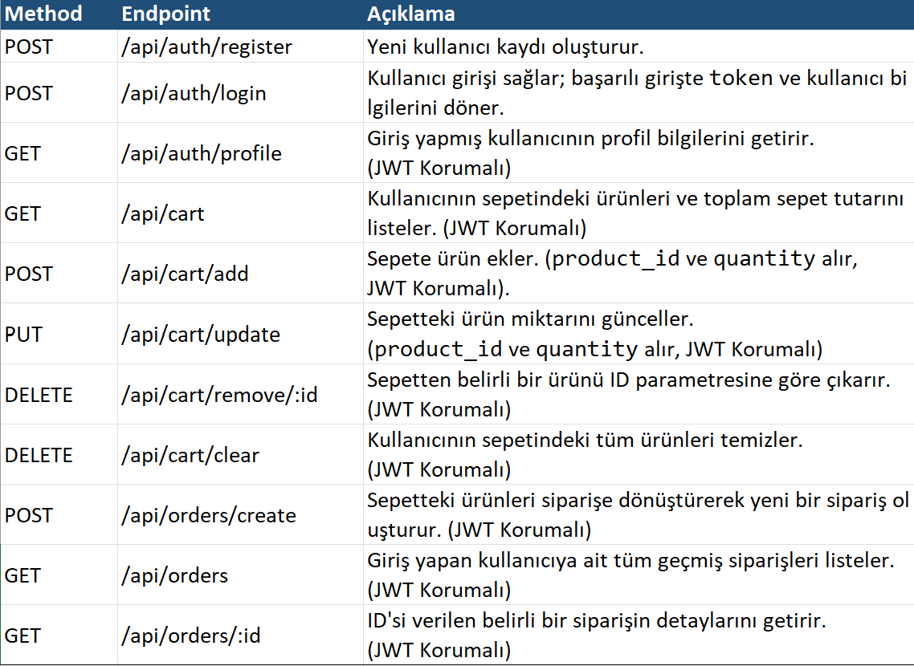

18. Backend Kodları
Kullanıcı Kimlik Doğrulama Kontrolü (AuthController) 
Bu modül, platforma üye olan kullanıcıların kayıt, giriş ve profil bilgilerinin güvenli bir şekilde yönetilmesini sağlayan RESTful API uç noktalarını (endpoints) barındırır. Sunucu tarafında veri güvenliğini ve oturum yönetimini optimize etmek amacıyla asenkron mimariyle kurgulanmıştır. 
const hashedPassword = await bcrypt.hash(password, 10);  
const isPasswordCorrect = await bcrypt.compare(password, user.password_hash);  
const token = jwt.sign( 

  { user_id: user.user_id, email: user.email, role: user.role }, 

  process.env.JWT_SECRET, 

  { expiresIn: "30d" } 

);

Sepet Yönetimi Kontrolü (CartController) 
Bu modül, kullanıcıların sepet oluşturma, ürün ekleme, adet güncelleme ve sepeti temizleme gibi işlemlerini yürüten temel iş mantığını (business logic) barındırır. Veri tabanında yer alan cart ve cart_items tabloları arasındaki ilişkisel bütünlüğü koruyarak dinamik sepet yönetimini sağlar. 
const result = await pool.query( 

  `   INSERT INTO cart_items (cart_id, product_id, quantity) 

  VALUES ($1, $2, $3) 

  ON CONFLICT (cart_id, product_id) 

  DO UPDATE SET quantity = cart_items.quantity + EXCLUDED.quantity 

  RETURNING * 

  , [cart.cart_id, product_id, itemQuantity] 

); 

Kategori Kontrolü (CategoryController) 
Bu modül, platformdaki ürünlerin sınıflandırılmasında kullanılan kategori tanımlarını yönetir. İstemci tarafındaki (Flutter) filtreleme menülerinin ve dinamik listelerin ihtiyaç duyduğu kategori başlıklarını sunucu üzerinden JSON formatında sağlar. 
const result = await pool.query(` 

  SELECT  

    category_id, 

    category_name 

  FROM categories 

  ORDER BY category_id ASC 

`); 

Sipariş Yönetimi Kontrolü (OrderController) 
Bu modül; sepetin onaylanması, stok kontrolü, sipariş kaydı, stok düşümü ve sepetin boşaltılması gibi adımlardan oluşan sipariş döngüsünü yönetir. E-ticaret akışının en kritik parçası olduğu için veri tabanı seviyesinde yüksek veri tutarlılığı kuralları içerir. 

Ürün Yönetimi Kontrolü (ProductController) 
Bu modül; platformdaki ürünlerin listelenmesi, aranması, filtrelenmesi ve yönetici paneli üzerinden gerçekleştirilen ekleme, güncelleme, silme (CRUD) işlemlerini yöneten merkezi kontrolör katmanıdır. 

Kimlik Doğrulama Yönlendiricisi (AuthRoutes) 
Bu modül, kullanıcı işlemlerine ait HTTP isteklerini (POST, GET) karşılayan ve bunları AuthController içerisindeki ilgili mantıksal fonksiyonlara eşleyen yönlendirici (router) katmanıdır. express.Router mimarisi kullanılarak uygulamanın ağ geçitleri modüler bir yapıda ayrıştırılmıştır. 

router.post("/register", register); 

router.post("/login", login); 

router.get("/profile", authMiddleware, getProfile); 

Sepet İşlemleri Yönlendiricisi (CartRoutes) 
Bu modül, sepet operasyonlarına ait HTTP isteklerini karşılayan ve CartController katmanındaki iş mantığı fonksiyonları ile eşleştiren yönlendirme (routing) bileşenidir. REST mimarisine uygun olarak her eylem için doğru HTTP metotları (GET, POST, PUT, DELETE) seçilmiştir. 

Kategori Yönlendiricisi (CategoryRoutes) 
Bu modül, platformdaki kategori listeleme isteklerini karşılayan yönlendirici katmanıdır. Kategori bilgileri genel e-ticaret vitrinini beslediği ve kişisel veri barındırmadığı için herkese açık (public) bir uç nokta olarak kurgulanmıştır. 

Sipariş İşlemleri Yönlendiricisi (OrderRoutes) 
Bu modül, sipariş oluşturma, geçmiş siparişleri listeleme ve belirli bir siparişin detaylarına erişme gibi kritik e-ticaret süreçlerinin ağ yönlendirmesini üstlenir. 

Ürün İşlemleri Yönlendiricisi (ProductRoutes) 
Bu modül, platformdaki ürünlerin yönetimini sağlayan ve ProductController katmanındaki CRUD (Ekleme, Okuma, Güncelleme, Silme) iş mantıklarını dış dünyaya açan yönlendirici (routing) bileşenidir. Standart RESTful API kalıplarına tam uyumlu bir URL hiyerarşisi sunar. 

Sunucu Ana Giriş Noktası ve Konfigürasyonu (server.js) 
Bu dosya, Node.js tabanlı backend uygulamasının giriş noktasıdır. Çevre değişkenlerinin yüklenmesi, Express sunucusunun ayağa kaldırılması, global ara yazılımların (middleware) tanımlanması, veri tabanı bağlantı testleri ve modüler rotaların ana API ağaçlarına bağlanması bu merkezden yönetilir. 
app.use(cors({ 

  origin: "*", 

  methods: ["GET", "POST", "PUT", "DELETE", "OPTIONS"], 

  allowedHeaders: ["Content-Type", "Authorization"], 

})); 

 app.use("/api/products", productRoutes); 

app.use("/api/auth", authRoutes); 

app.use("/api/cart", cartRoutes); 

app.use("/api/orders", orderRoutes); 

Kimlik Doğrulama Ara Yazılımı (AuthMiddleware) 
Bu modül, korumalı API uç noktalarına gelen HTTP isteklerinin güvenliğini sağlamak ve yetkilendirme kontrollerini gerçekleştirmek amacıyla geliştirilmiş bir ara yazılım (middleware) katmanıdır. İsteklerin denetleyicilere (controllers) ulaşmadan önce geçerli bir kimlik jetonu taşıyıp taşımadığını kontrol eder. 

İstemci-Sunucu Haberleşme Servisi (ApiService) 
Bu modül, Flutter (istemci) katmanı ile Node.js (sunucu) API uç noktaları arasındaki asenkron veri akışını yöneten merkezi servis katmanıdır. Uygulamanın tüm HTTP protokol işlemlerini ve yerel veri saklama mekanizmalarını tek bir soyutlama sınıfı (static) altında toplar.
static Future<Map<String, String>> authHeaders() async { 

  final prefs = await SharedPreferences.getInstance(); 

  final token = prefs.getString('token'); // Kalıcı hafızadan token okuma 

  return { 

    'Content-Type': 'application/json', 

    if (token != null) 'Authorization': 'Bearer $token',  

  }; 

} 

static Future<List<ProductModel>> getProducts() async { 

  final response = await http.get(Uri.parse('$baseUrl/api/products')); 

  if (response.statusCode == 200) { 

    final List<dynamic> data = jsonDecode(response.body); 

    return data.map((item) => ProductModel.fromJson(item)).toList();  

  } else { 

    throw Exception('Ürünler getirilemedi'); 

  } 

} 

19. Arayüz Görselleri
WEB
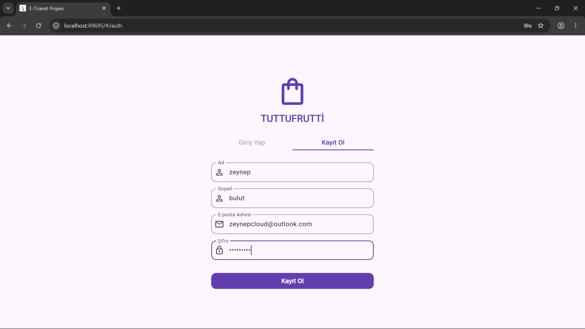
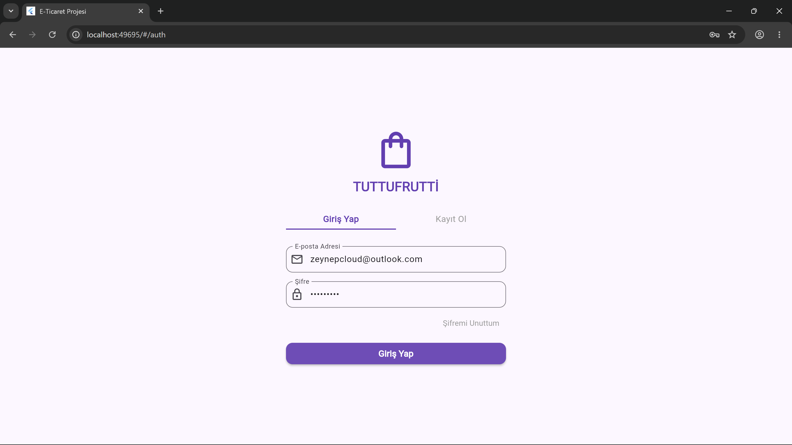

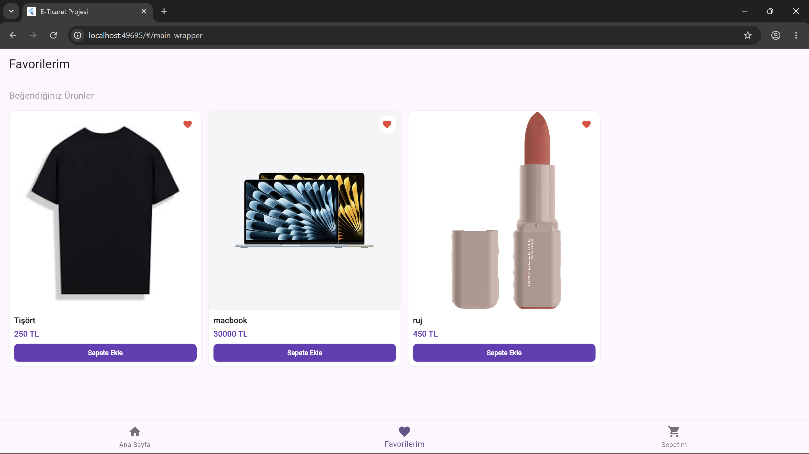

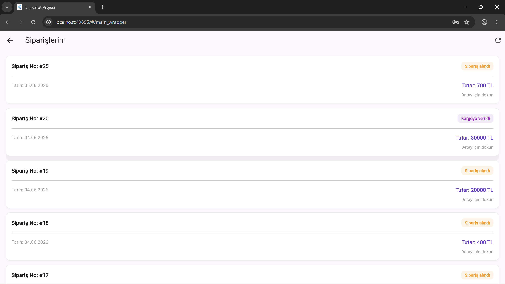

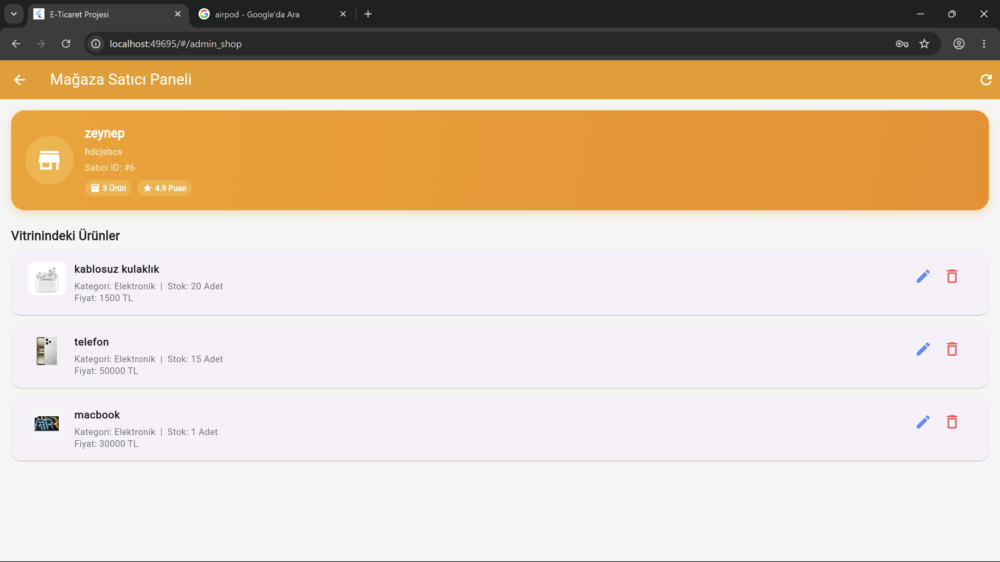

iOS

21. Arayüz Klasör Yapısı ve Mimari Düzen
Projenin kaynak kodları modüler bir klasör hiyerarşisinde yapılandırılmıştır. 

core/models/: Veritabanı (ER) diyagramındaki tablolarla (Products, Orders) uyumlu Dart sınıflarını barındırır. 

core/constants/: Uygulama genelinde kullanılan küresel veri havuzlarını ve statik yapılandırmaları tutar.  

views/: Kullanıcının etkileşime girdiği bağımsız ekran tasarımlarını (home, admin, admin_shop ,auth,cartandchecout , favorites, orders, product_detail) içerir. 
Veritabanı (ER) diyagramındaki tablolara tam uyum sağlamak adına geliştirilen Product Model veri yapısı, JSON serileştirme (Serialization) yeteneğiyle donatılmıştır. 

Mağaza Satıcı Paneli (AdminShopView) 
Bu modül, satıcıların vitrindeki ürünlerini anlık olarak listelemesi ve yönetmesi amacıyla geliştirilmiştir. StatefulWidget yapısında kurulan sayfada, backend'den gelen veriler FutureBuilder bileşeniyle asenkron olarak dinlenir; yükleme ve hata durumları kullanıcıya dinamik olarak yansıtılır. Ürün silme veya yenileme işlemlerinde refreshProducts() fonksiyonu üzerinden setState tetiklenerek arayüz güncel tutulur. 

Mağaza Yönetim Paneli (AdminView) 
Bu modül, yöneticilerin platforma yeni ürünleri eksiksiz ve kontrollü bir şekilde eklemesini sağlayan form arayüzüdür. Kullanıcıdan alınan veriler backend'e iletilmeden önce katı bir doğrulama sürecinden geçirilir. 

int? getCategoryId(String categoryText) { 

  final category = categoryText.trim().toLowerCase(); 

  if (category == 'elektronik') return 1; 

  if (category == 'giyim' || category == 'moda') return 2; 

  if (category == 'kozmetik') return 3; 

  return null; 

} 

final price = double.tryParse(priceText.replaceAll(',', '.')); 

final categoryId = getCategoryId(categoryText); 

if (categoryId == null) { 

  showMessage('Kategori sadece Elektronik, Giyim/Moda veya Kozmetik olabilir.'); 

  return; 

}

Kimlik Doğrulama Modülü (AuthView) 
Bu modül, kullanıcıların  platforma güvenli bir şekilde giriş yapmasını ve yeni hesap oluşturmasını sağlayan tek ekranlı (hybrid) bir kimlik doğrulama arayüzüdür. isLoginView kontrolüyle form alanları dinamik olarak değiştirilir. 
Future<void> handleAuth() async {  

 setState(() => isLoading = true); 

 try { 

 if (isLoginView) { await ApiService.login(email: email, password: password);  

if (!mounted) return;  

Navigator.pushReplacementNamed(context, '/main_wrapper'); } 

 else { 

 await ApiService.register(/* parametreler */); setState(() => isLoginView = true); 

  } 

 } catch (e) } 

Sepet ve Ödeme Modülü (CartView) 
Bu modül, kullanıcıların sepetlerindeki ürünleri listelemesini, toplam tutarı anlık hesaplamasını ve entegre ödeme formu üzerinden siparişlerini tamamlamasını sağlar. Veriler FutureBuilder ile asenkron olarak yönetilir. 

Favori Ürünler Modülü (FavoritesView) 
Bu modül, kullanıcıların beğendikleri ürünleri takip edebilmeleri amacıyla geliştirilmiş StatelessWidget yapısında bir arayüz bileşenidir. Hibrit (Web ve Mobil) geliştirme pratiklerine uygun olarak esnek bir tasarım sunar. 

Ana Sayfa ve Vitrin Modülü (HomeView) 
Bu modül, kullanıcıların platformdaki ürünleri kategorilerine göre filtreleyebildiği, arama yapabildiği ve güncel fırsatları listeleyebildiği ana vitrin arayüzüdür. Hem mobil (iOS) hem de masaüstü (Web) platformlarda pürüzsüz bir kullanıcı deneyimi sunmak üzere tasarlanmıştır. 

 final double screenWidth = MediaQuery.of(context).size.width; 

 int crossAxisCount = screenWidth > 600 ? 4 : 2; 

 double cardAspectRatio = screenWidth < 360 ? 0.62 : 0.70; 

Siparişlerim Modülü (OrdersView) 
Bu modül, kullanıcıların geçmiş ve mevcut siparişlerini listelemesi, durum takibi yapması ve sipariş detaylarını incelemesi amacıyla geliştirilmiştir. Asenkron veri yönetimi ve alt arayüz katmanları (Bottom Sheet) etkin şekilde kullanılmıştır. 

Color getStatusColor(String status) {  

if (status == 'delivered' || status == 'Teslim Edildi') return Colors.green;  

if (status == 'shipped' || status == 'Yolda') return Colors.blue; 

 if (status == 'cancelled' || status == 'İptal Edildi') return Colors.red;  

return Colors.orange; } 

Ürün Detay Modülü (ProductDetailView) 
Bu modül, vitrinden seçilen belirli bir ürünün görselini, fiyatını, stok miktarını ve detaylı açıklamasını listelemek üzere tasarlanmış StatelessWidget yapısında bir ekrandır. Sayfa, verileri dinamik bir şekilde argüman olarak devralır. 

Ana Sarmalayıcı ve Sekme Yönetimi Modülü (MainWrapperView) 
Bu modül, uygulamanın ana iskeletini oluşturan ve alt navigasyon çubuğu (BottomNavigationBar) ile ana sekmeler arasındaki kalıcı geçişleri yöneten bir StatefulWidget bileşenidir. Uygulama içi kullanıcı deneyiminde akışkanlığı sağlamak adına merkezi bir kapsayıcı görevi görür.

Uygulama Ana Giriş Noktası ve Rota Yönetimi (main.dart) 
Bu dosya, uygulamanın başlatıldığı ana giriş noktasıdır (main()) ve platformun tüm sayfa geçişlerini tek bir merkezden yöneten statik rota (routing) mimarisini barındırır. StatelessWidget yapısında kurulan MyApp sınıfı, genel tema ve kimlik ayarlarını üstlenir. 
@override 
Widget build(BuildContext context) { 

  return MaterialApp( 

    title: 'E-Ticaret Projesi', 

    debugShowCheckedModeBanner: false, 

    theme: ThemeData( 

      colorScheme: ColorScheme.fromSeed(seedColor: Colors.deepPurple), 

      useMaterial3: true, 

    ), 

    initialRoute: '/auth',  

    routes: { 

      '/auth': (context) => const AuthView(), 

      '/main_wrapper': (context) => const MainWrapperView(),  

      '/admin': (context) => const AdminView(), 

      '/admin_shop': (context) => const AdminShopView(), 

    }, 

  ); 

} 

Sepet Ögesi Veri Modeli (CartItemModel) 
Bu sınıf, sepet içerisindeki her bir özgün ürünü, eklenme adedini ve ilişkisel veri tabanındaki benzersiz kimliğini (cart_item_id) temsil eden veri modelidir. Nesne yönelimli mimari ile backend JSON formatı arasındaki dönüşümü (Serileştirme) sağlar. 

Veri Modeli (OrderMode Sipariş l) 
Bu sınıf, kullanıcının geçmiş siparişlerini ve bu siparişlerin durumlarını istemci tarafında nesne yönelimli olarak temsil eden veri modelidir. Backend'den gelen sipariş geçmişi listelerini ve detay verilerini işlemek üzere serileştirme altyapısını kurar. 

Ürün Veri Modeli (ProductModel) 
Bu sınıf, platformdaki tüm ürün kartlarını, arama listelerini ve detay sayfalarını besleyen ana veri modelidir. Hem mevcut lokal arayüz mantığını koruyacak hem de ilişkisel veri tabanından (PostgreSQL/Supabase) dönen zenginleştirilmiş yeni mimariyi destekleyecek şekilde hibrit yapıda tasarlanmıştır. 

Kullanıcı Veri Modeli (UserModel) 
Bu sınıf, platformdaki kullanıcıların profil bilgilerini ve yetki seviyelerini istemci tarafında nesne yönelimli olarak temsil eden veri modelidir. Backend katmanındaki users tablosuyla tam uyumlu şekilde kurgulanmıştır. 

Ekran Algoritmaları 
Uygulamanın hem masaüstü tarayıcılarda hem de farklı mobil ekran çözünürlüklerinde (iOS/Android) taşma hatası (Pixel Overflow) vermeden çalışması için matematiksel esneklik hesaplamaları koda entegre edilmiştir. Ayrıca arayüzdeki kritik metin alanları Expanded ve Flexible widget’ ları ile sarmalanarak daralmalarda metnin sağa taşması engellenmiş ve otomatik alt satıra geçiş özelliği eklenmiştir. 
@override 
Widget build(BuildContext context) { 

  final double screenWidth = MediaQuery.of(context).size.width; 
 int crossAxisCount = screenWidth > 600 ? 4 : 2; 
 double cardAspectRatio = screenWidth < 360 ? 0.62 : 0.70; 
 return Scaffold( 
  body: SafeArea( 
    child: SingleChildScrollView(  

        physics: const BouncingScrollPhysics(), 

        child: Column(...), 

      ), 

    ), 

  ); 

} 

Veri Yönetimi ve State Management 
Flutter 'ın yerleşik ve performanslı state yönetim mekanizması olan ValueNotifier ve ValueListenableBuilder yapıları tercih edilmiştir. Bunun nedeni ağır kütüphanelerin getireceği yüklerden kaçınmaktır. 
AppConstants altında tanımlanan küresel asenkron veri havuzu, bir ürün eklendiğinde veya silindiğinde tüm arayüzü tetikler. Sistem, sayfayı bütünüyle yeniden çizmek (rebuild) yerine sadece değişen bileşenleri dinamik olarak günceller. 

21. Yapılan Araştırmalar,
Yapılan Araştırmalar 

Proje geliştirme sürecinde hem veritabanı tasarımı hem de backend/frontend entegrasyonu açısından çeşitli araştırmalar yapılmıştır. Araştırmaların temel amacı, sistemin yalnızca çalışan bir arayüzden ibaret olmaması; veritabanı, API ve kullanıcı akışlarının birlikte tutarlı şekilde çalışmasıdır. 
*PostgreSQL tablo ilişkileri ve veri tipleri 
*5N normalizasyon kuralları 
*Primary Key, Foreign Key, Unique, Not Null, Default ve Check kısıtlayıcıları 
*Index, View, Trigger, Function ve Stored Procedure kullanımı 
*Supabase bağlantısı ve bağlantı bilgilerinin güvenli tutulması 
*Node.js ve Express.js ile REST API geliştirme 
*Flutter ile web ve iOS arayüz geliştirme 
*GitHub üzerinde proje dosyalarının düzenli tutulması 
Karşılaşılan ilk önemli sorun, backend ile veritabanı bağlantısının doğru yapılandırılması olmuştur. Bu süreçte Supabase bağlantı bilgileri, environment değişkenleri ve backend tarafındaki bağlantı ayarları kontrol edilmiştir. Veritabanı bağlantısının doğrudan kod içine yazılmaması, .env dosyası üzerinden yönetilmesi daha güvenli ve düzenli bir çözüm olarak tercih edilmiştir. 

Bir diğer önemli aşama tablolar arasındaki ilişkilerin doğru kurulmasıdır. Orders tablosundaki user_id alanı users tablosuna, order_items tablosundaki order_id ve product_id alanları orders ve products tablolarına bağlanmıştır. Products tablosundaki category_id alanı categories tablosu ile ilişkilendirilmiş; cart ve addresses tablolarında ise user_id üzerinden kullanıcı ilişkileri kurulmuştur. Bu yapı sayesinde sistemin veri bütünlüğü korunmuş ve gerçek bir e-ticaret senaryosuna uygun bir model elde edilmiştir. 

Ayrıca trigger ve procedure yapılarının nasıl çalışacağı araştırılmıştır. Özellikle sipariş oluşturulduğunda stok miktarının otomatik azalması, veritabanı tarafında iş mantığı kurulmasına örnek olarak değerlendirilmiştir. View yapıları ise ürün-kategori ve kullanıcı-sipariş gibi sık kullanılan birleşik sorguların daha düzenli okunabilmesi için kullanılmıştır. 

 Proje dizinlerinin yerel diske taşınması esnasında Windows işletim sisteminin `build/flutter_assets` ve `ephemeral` klasörlerini arka plan süreçlerinde (process) kilitli tuttuğu gözlemlenmiştir. Yapılan araştırmalar neticesinde, arka plandaki inatçı Dart süreçlerinin işletim sistemi seviyesinde sonlandırılması için terminal üzerinden `taskkill /F /IM dart.exe` komut mimarisi entegre edilmiş ve sorun giderilmiştir.  

 Terminalden `flutter clean` komutu yürütülürken `pubspec.yaml` dosyasının bulunamadığı hatasıyla karşılaşılmıştır. Klasör hiyerarşisi incelenerek terminal süreçlerinin projenin root dizini yerine bir üst klasörde kaldığı saptanmış; çözüm olarak entegre terminal yolları `online_siteproje/onlinesite` dizinine `cd` komutuyla yönlendirilmiştir.  

 Sayfaların her veri değişiminde bütünüyle yeniden çizilmesinin (SetState anti-pattern) performansı düşürdüğü görülmüştür. Flutter'ın yerleşik çekirdeği incelenerek, harici bir kütüphane yüklemeden en hafif çözümü sunan Observer Tasarım Kalıbı (ValueNotifier) yapısı araştırılmış ve projeye entegre edilmiştir.

 22. Test Verileri
PDF’de belirtilen beklentiye uygun olarak her tabloya en az 10 adet gerçekçi dummy data eklenmelidir. Bu veriler ile View, Trigger, Index, Function ve Procedure yapılarının çalışıp çalışmadığı test edilmelidir.
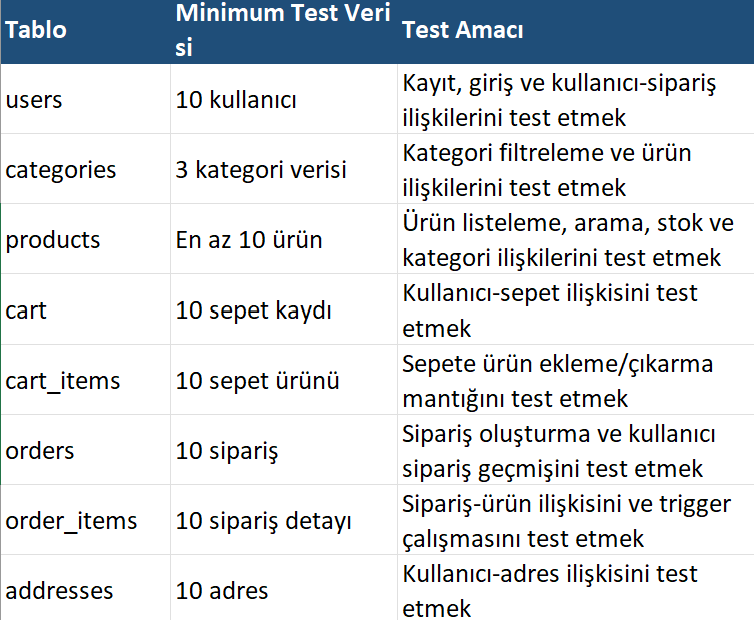

23. Projenin Çalıştırıması

23.1 Projeyi Klonlama
git clone GITHUB_LINKI_BURAYA

23.2 Backend Kurulumu
cd backend 
npm install 
npm run dev 

23.3 Environment Ayarları
.env dosyasında aşağıdaki değişkenler tanımlanmalıdır: 

DATABASE_URL=... 
SUPABASE_URL=... 
SUPABASE_KEY=... 
PORT=3000 

23.4 Frontend / Web Kurulumu 
cd backend\tuttufrutti\online_siteproje\onlinesite 
flutter pub get 
flutter run -d chrome 

23.5 iOS Kurulumu 
cd ios
flutter pub get 
flutter run

24. Sonuç
Bu proje kapsamında web ve iOS platformlarında çalışabilecek temel özelliklere sahip bir e-ticaret sistemi geliştirilmiştir. Projede kullanıcı, ürün, kategori, sepet, sipariş ve adres işlemleri için ilişkisel bir veritabanı tasarımı oluşturulmuştur. 

Veritabanı tasarımı yapılırken veri tekrarını azaltmak, veri bütünlüğünü korumak ve ekleme, silme, güncelleme anomalilerini önlemek amacıyla normalizasyon kurallarına dikkat edilmiştir. Primary Key, Foreign Key, Unique, Not Null, Check ve Default kısıtlayıcıları ile verilerin tutarlı saklanması sağlanmıştır. Bunun yanında Index, View, Trigger, Function ve Stored Procedure yapılarından yararlanılarak veritabanı işlemleri daha düzenli, hızlı ve kontrollü hale getirilmiştir. 

Uygulamanın sunucu ve API katmanı geliştirilirken modülerlik, veri güvenliği ve ACID uyumlu işlem yönetimi ilkelerine sadık kalınmıştır. Express Router ve asenkron kontrolör mimarisiyle iş mantığı bağımsız katmanlara ayrıştırılmış; bcrypt ile kriptografik şifreleme ve JWT ara yazılımı entegrasyonu sayesinde durumsuz ve güvenli bir oturum yönetimi sunulmuştur. Bunun yanında, havuz tabanlı PostgreSQL ve Supabase bağlantı yapısı, dinamik ve parametrik SQL sorgu inşası ile hata yakalama mekanizmalarından yararlanılarak istemci-sunucu arasındaki veri akışının kesintisiz, performanslı ve SQL enjeksiyonu gibi tehditlere karşı korumalı olması sağlanmıştır. 

Uygulamanın arayüz ve istemci tarafı geliştirilirken responsive (esnek) tasarım mimarisine, asenkron veri yönetimine ve platformlar arası kod bütünlüğüne dikkat edilmiştir. StatefulWidget ve StatelessWidget yapıları ile arayüz bileşenleri modüler hale getirilmiş; MediaQuery, SliverGridDelegate ve BouncingScrollPhysics gibi bileşenler kullanılarak hem dar hem de geniş ekranlarda piksel taşmalarını önleyen kullanıcı dostu bir deneyim sunulmuştur. Bunun yanında, merkezi Named Routes rota yönetimi, FutureBuilder asenkron veri bağlama mimarisi ve nested model içeren CartItemModel mimarisinden yararlanılarak backend ile entegrasyon daha düzenli, hızlı ve güvenli hale getirilmiştir. 

Proje geliştirme sürecinde ilişkisel veritabanı tasarımı, SQL sorguları, PostgreSQL kullanımı, Supabase bağlantısı, backend geliştirme, REST API yapısı ve Flutter tabanlı frontend/mobil arayüz geliştirme süreçleri gerçek bir e-ticaret senaryosu üzerinden uygulanmıştır. Sonuç olarak kullanıcıların ürünleri görüntüleyebildiği, sepete ürün ekleyebildiği, sipariş oluşturabildiği ve siparişlerini takip edebildiği; admin tarafında ise ürün ve stok yönetimi yapılabilen bir sistem ortaya çıkarılmıştır.

25. Referanslar

[1] Supabase Documentation, https://supabase.com/docs 
[2] Node.js Documentation, https://nodejs.org/docs/ 
[3] Express.js Documentation, https://expressjs.com/ 
[4] Flutter Documentation, https://docs.flutter.dev/ 

 
 

 

   
